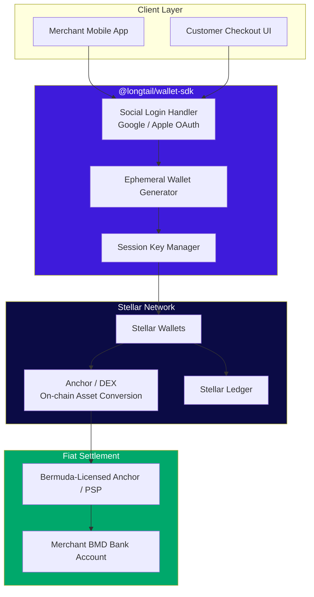

# 🐦 Longtail

**Stellar payments, Bermuda simple.**

Longtail is a two-layer Stellar payments stack: an invisible wallet infrastructure layer that abstracts crypto complexity behind familiar Web2 logins, and a flagship point-of-sale app that puts that infrastructure to work for local Bermudian merchants.

> Named after the _white-tailed tropicbird_ — Bermuda's national bird and a symbol found on its coinage and coat of arms. Just as the longtail is a fixture of the Bermudian coastline, this project aims to be a fixture of Bermudian commerce.

[](#license)
[](https://stellar.org)
[](#roadmap)

---

## Table of Contents

- [Overview](#overview)
- [The Problem](#the-problem)
- [The Solution](#the-solution)
- [Architecture](#architecture)
- [Repository Structure](#repository-structure)
- [Core Features](#core-features)
  - [Layer 1 — `@longtail/wallet-sdk`](#layer-1--longtailwallet-sdk)
  - [Layer 2 — Longtail POS](#layer-2--longtail-pos)
- [Tech Stack](#tech-stack)
- [How It Works](#how-it-works)
- [Getting Started](#getting-started)
- [Usage Examples](#usage-examples)
- [Security & Compliance](#security--compliance)
- [Roadmap](#roadmap)
- [Contributing](#contributing)
- [License](#license)

---

## Overview

Longtail is built on two complementary products:

|                  | **Longtail Wallet SDK**                                                                      | **Longtail POS**                                                                                                    |
| ---------------- | -------------------------------------------------------------------------------------------- | ------------------------------------------------------------------------------------------------------------------- |
| **What it is**   | A developer tool / SDK                                                                       | A mobile point-of-sale app                                                                                          |
| **Audience**     | Developers building on legacy web/mobile stacks                                              | Bermudian small businesses & their customers                                                                        |
| **Core job**     | Spin up invisible, single-use Stellar wallets via Google/Apple login — no seed phrases, ever | Accept Stellar-based digital assets at checkout, abstract gas fees, and settle instantly in Bermudian dollars (BMD) |
| **Relationship** | The engine                                                                                   | The flagship application built on the engine                                                                        |

The Wallet SDK is the infrastructure layer that makes crypto payments feel like a normal login. Longtail POS is the first real-world proof that the infrastructure works — a merchant-facing app where nobody involved needs to know what a blockchain is.

## The Problem

- **Crypto UX is still broken for normal people.** Seed phrases, gas fees, and wallet extensions are a hard wall for merchants and customers who just want to accept and make payments.
- **Small island economies are underserved by traditional payment rails.** Card processing fees, chargebacks, and slow settlement hurt small Bermudian merchants disproportionately.
- **Stellar is fast and cheap, but inaccessible.** The chain solves the settlement problem; it doesn't solve the _human_ problem of onboarding non-crypto-native users.

## The Solution

Longtail hides the blockchain entirely:

1. A merchant or customer logs in with a social account they already have (Google or Apple).
2. An ephemeral, single-use Stellar wallet is generated behind the scenes for that session or transaction.
3. Digital assets received are instantly converted on-chain to local fiat (BMD) and settled to the merchant.
4. Nobody sees a seed phrase, a gas fee, or a wallet address. It just feels like tapping "pay."

## Architecture



**Transaction flow, in short:** customer pays with a Stellar asset → Wallet SDK receives it in an ephemeral wallet → asset is converted on-chain to fiat-pegged value via an anchor/DEX path → funds settle into the merchant's BMD account. Gas fees are sponsored/abstracted at the SDK layer so end users never hold or spend the network's native asset (XLM) directly.

## Repository Structure

This is a monorepo. The SDK and the POS app live side by side, sharing common types and utilities.

```
longtail/
├── apps/
│   └── pos/                     # Longtail POS — merchant-facing mobile app
│       ├── src/
│       │   ├── screens/
│       │   ├── components/
│       │   ├── checkout/        # Payment flow, QR/tap-to-pay
│       │   └── settlement/      # Fiat conversion + payout tracking
│       └── package.json
│
├── packages/
│   ├── wallet-sdk/               # @longtail/wallet-sdk — core dev tool
│   │   ├── src/
│   │   │   ├── auth/            # Google / Apple social login adapters
│   │   │   ├── wallet/          # Ephemeral wallet generation & lifecycle
│   │   │   ├── signing/         # Transaction signing, key custody
│   │   │   └── index.ts
│   │   └── package.json
│   │
│   ├── stellar-core/              # Shared Stellar/Horizon/Soroban client logic
│   ├── fx-engine/                 # On-chain asset → BMD conversion logic
│   └── ui-kit/                    # Shared design system components
│
├── infra/
│   ├── anchor-config/             # Anchor / on/off-ramp configuration
│   └── deployment/                # IaC, CI/CD pipelines
│
├── docs/
│   ├── architecture.md
│   ├── compliance.md
│   └── api-reference.md
│
├── .env.example
├── turbo.json                     # Monorepo task runner config
└── README.md
```

## Core Features

### Layer 1 — `@longtail/wallet-sdk`

- **Social-login-native wallets** — users authenticate with Google or Apple; no wallet app, browser extension, or seed phrase ever surfaces.
- **Ephemeral, single-use design** — wallets are generated per-session or per-transaction and can be configured to self-expire, minimizing standing attack surface.
- **Seed phrase abstraction** — key material is derived and managed via secure enclave / MPC-style custody (see [Security & Compliance](#security--compliance)); the end user never sees or handles it.
- **Gas abstraction** — transaction fees are sponsored so users never need to hold XLM to transact.
- **Drop-in integration** — designed to be embedded into existing ("legacy") web2 apps with a small SDK footprint, not a full Web3 migration.
- **Framework agnostic core** — a thin core library with adapters for React, React Native, and vanilla JS.

### Layer 2 — Longtail POS

- **Ultra-lightweight mobile app** — built for low-end Android devices common among small Bermudian retailers, minimal storage/RAM footprint.
- **Instant fiat settlement** — Stellar-based digital assets received at checkout are converted on-chain and settled to the merchant's BMD account, typically within seconds.
- **Zero visible gas fees** — powered by the Wallet SDK's fee abstraction; merchants never see network fees deducted from a sale.
- **Offline-friendly queuing** — transactions can be queued locally and broadcast once connectivity resumes (useful for Bermuda's more remote areas).
- **Simple onboarding** — a merchant can go from download to first sale in minutes using social login, no crypto exchange account required.
- **Local compliance-first design** — built with Bermuda's Digital Asset Business Act (DABA) framework in mind (see [Security & Compliance](#security--compliance)).

## Tech Stack

| Layer            | Technology                                                                            |
| ---------------- | ------------------------------------------------------------------------------------- |
| Mobile app (POS) | React Native (or Flutter — TBD, see [Roadmap](#roadmap))                              |
| Wallet SDK       | TypeScript, Stellar SDK (`js-stellar-sdk`), Soroban (for future smart contract logic) |
| Blockchain       | Stellar network (mainnet/testnet), Horizon API                                        |
| Auth             | OAuth 2.0 (Google, Apple)                                                             |
| Key custody      | Secure enclave / threshold signing (MPC) — provider TBD                               |
| On/off-ramp      | Licensed Stellar anchor(s) operating in/around Bermuda                                |
| Backend          | Node.js, PostgreSQL, Redis (session/queue state)                                      |
| Infra            | Docker, Terraform, GitHub Actions (CI/CD)                                             |
| Monorepo tooling | Turborepo, pnpm workspaces                                                            |

## How It Works

### Wallet creation (SDK)

1. Developer integrates `@longtail/wallet-sdk` into their app.
2. End user clicks "Continue with Google/Apple."
3. SDK exchanges the OAuth token for a deterministic or session-bound key derivation.
4. An ephemeral Stellar wallet is created and funded (if needed) via a sponsoring account to cover the minimum reserve.
5. The wallet is used for the current session/transaction, then expired or archived per the developer's configuration.

### A sale (POS)

1. Merchant opens Longtail POS and logs in (wallet auto-provisioned via the SDK).
2. Customer scans a QR code or taps to pay with a Stellar-based asset (e.g., a USD-pegged Stellar asset).
3. The asset lands in the merchant's ephemeral wallet.
4. The `fx-engine` package routes the asset through an anchor/DEX path to convert it to BMD value.
5. Funds settle to the merchant's linked bank account (or an in-app BMD balance) — typically within seconds to minutes, not days.

## Getting Started

### Prerequisites

- Node.js ≥ 20
- pnpm ≥ 9
- A Stellar testnet account (for local development)
- Google & Apple OAuth client credentials (for auth testing)

### Installation

```bash
# Clone the repo
git clone https://github.com/devprom6/Longtail.git
cd longtail

# Install dependencies across the monorepo
pnpm install

# Copy environment templates
cp .env.example .env
```

### Environment Variables

```bash
# .env
STELLAR_NETWORK=testnet              # or "public" for mainnet
HORIZON_URL=https://horizon-testnet.stellar.org
SPONSOR_ACCOUNT_SECRET=              # funds wallet reserves & sponsors fees
GOOGLE_CLIENT_ID=
GOOGLE_CLIENT_SECRET=
APPLE_CLIENT_ID=
APPLE_TEAM_ID=
ANCHOR_API_URL=                      # licensed anchor for BMD conversion
DATABASE_URL=postgres://...
REDIS_URL=redis://...
```

### Running locally

```bash
# Run the wallet SDK in watch mode
pnpm --filter @longtail/wallet-sdk dev

# Run the POS app (mobile simulator)
pnpm --filter pos dev
```

## Usage Examples

### Integrating the Wallet SDK into an existing web app

```ts
import { LongtailWallet } from "@longtail/wallet-sdk";

const wallet = new LongtailWallet({
  network: "testnet",
  authProvider: "google",
});

// Trigger social login and provision an ephemeral wallet
const session = await wallet.connect();

console.log(session.publicKey); // Stellar public key — never exposes a secret/seed
console.log(session.expiresAt); // Ephemeral session expiry

// Send a payment — gas is abstracted automatically
await wallet.sendPayment({
  destination: "GABC...XYZ",
  amount: "25.00",
  assetCode: "USDC",
});
```

### Processing a sale in Longtail POS (internal API)

```ts
import { createSale } from "@longtail/pos/checkout";

const sale = await createSale({
  merchantWallet: session,
  amount: "25.00",
  assetCode: "USDC",
});

// fx-engine handles conversion + settlement
const settlement = await sale.settle({ targetCurrency: "BMD" });

console.log(settlement.status); // "settled"
console.log(settlement.bmdAmount); // e.g. 25.00
```

## Security & Compliance

- **No custodial seed exposure to end users.** All key material is generated and held via secure enclave or threshold (MPC) signing; users authenticate via OAuth, never by handling private keys.
- **Ephemeral by design.** Session-bound wallets reduce the standing attack surface compared to long-lived custodial wallets.
- **Bermuda regulatory alignment.** Longtail POS is designed with Bermuda's **Digital Asset Business Act (DABA)** in mind and is intended to operate alongside licensed digital asset businesses and anchors rather than as an unlicensed money transmitter. Legal review and licensing are required before any mainnet/production launch handling real customer funds — nothing in this repository constitutes legal or regulatory advice.
- **Audits.** Smart contract logic (Soroban, if/when introduced) and custody flows should undergo independent security audits before mainnet deployment.
- **Fee sponsorship model.** Sponsoring accounts that cover network fees and minimum reserves must be monitored and rate-limited to prevent abuse/drain attacks.

## Roadmap

- [ ] Finalize key custody provider (secure enclave vs. MPC vendor)
- [ ] Testnet MVP of `@longtail/wallet-sdk` with Google login
- [ ] Testnet MVP of Longtail POS with simulated BMD settlement
- [ ] Apple login support
- [ ] Licensed anchor integration for live BMD on/off-ramp
- [ ] Bermuda regulatory engagement / DABA licensing pathway
- [ ] Offline transaction queuing for low-connectivity merchants
- [ ] Merchant dashboard (web) for sales history & payouts
- [ ] Public SDK release + developer docs site
- [ ] Mainnet pilot with a small cohort of Bermudian merchants
- [ ] Expand Wallet SDK licensing to third-party developers outside the POS use case

## Contributing

Contributions are welcome. Please open an issue to discuss significant changes before submitting a pull request. Standard flow:

1. Fork the repo
2. Create a feature branch (`git checkout -b feature/my-feature`)
3. Commit your changes
4. Open a PR against `main`

## License

[MIT](LICENSE) — see the `LICENSE` file for details.

---

_Longtail is an early-stage project. Nothing in this repository should be construed as financial, legal, or regulatory advice. Any production deployment handling real customer funds requires appropriate licensing in the relevant jurisdiction(s)._
