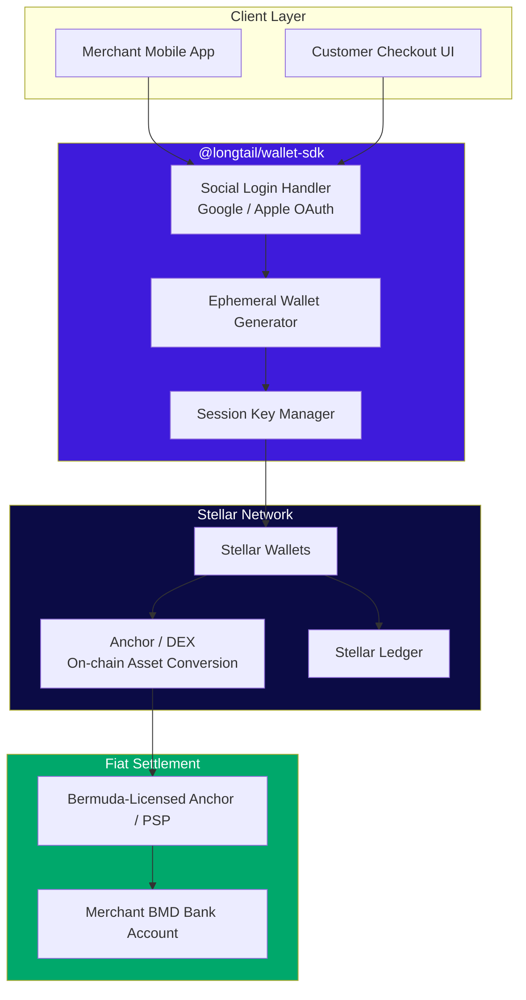

# Architecture

```mermaid
flowchart TD
    subgraph Client["Client Layer"]
        A[Merchant Mobile App]
        B[Customer Checkout UI]
    end

    subgraph SDK["@longtail/wallet-sdk"]
        C[Social Login Handler<br/>Google / Apple OAuth]
        D[Ephemeral Wallet Generator]
        E[Session Key Manager]
    end

    subgraph Chain["Stellar Network"]
        F[Stellar Wallets]
        G[Anchor / DEX<br/>On-chain Asset Conversion]
        H[Stellar Ledger]
    end

    subgraph Fiat["Fiat Settlement"]
        I[Bermuda-Licensed Anchor / PSP]
        J[Merchant BMD Bank Account]
    end

    A --> C
    B --> C
    C --> D
    D --> E
    E --> F
    F --> H
    F --> G
    G --> I
    I --> J

    style SDK fill:#3E1BDB,color:#fff
    style Chain fill:#0B0B45,color:#fff
    style Fiat fill:#00A86B,color:#fff
```
